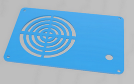
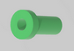

# Capsa-Sintetitzador-Live-Coding
Es tracta d'una capsa per allotjar el hardware sintetitzador per realitzar Live Coding utilitzant l'entorn de Microblocks 

 

Realitzat per [Jordi Mayné](https://github.com/maynej) des de Mechatronic Study jordi.mayne@mechatronicstudy.com 

La documentació està [en PDF](https://github.com/maynej/Capsa-Sintetitzador-Live-Coding/tree/main/DOC/). 

# Arxius per imprimir 
  
Descripció         | Imatge          | Arxiu STL    
------------- | ------------- | ------------- 
Capsa | | [Capsa](STL/Capsa_Sinte.stl)
Tapa | | [Tapa](STL/TapaPin_Sinte.stl)
Pin Polsador | | [Pin polsador](STL/Pin_Sinte.stl)
 
## Llicència
Creative Commons Attribution-NoComercial-ShareAlike 4.0 International (CC BY-NC-SA 4.0)  

## QR

