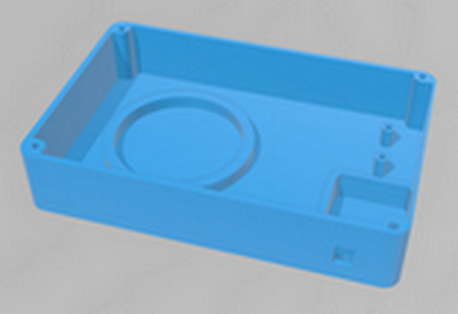

# Capsa-Sintetitzador-Live-Coding
Es tracta d'una capsa per allotjar el hardware sintetitzador per realitzar Live Coding utilitzant l'entorn de Microblocks 

 

Realitzat per [Jordi Mayné](https://github.com/maynej) des de Mechatronic Study jordi.mayne@mechatronicstudy.com 

La documentació està disponible també en castellà [en PDF](https://github.com/maynej/Capsa-Sintetitzador-Live-Coding/tree/main/Doc/). 

# Arxius per imprimir 
  
Descripció         | Imatge          | Arxiu STL    
------------- | ------------- | ------------- 
Capsa | | [Microbit](STL/Capsa_Sinte.stl)
Tapa | | [Expander](STL/Tapa_Sinte.stl)
Pin Polsador | | [Expander](STL/Pin_Sinte.stl)
 
Exemple d'ús del suport de la placa expansora per Micro:bit https://github.com/maynej/PerotBot

Creative Commons Attribution-NoComercial-ShareAlike 4.0 International (CC BY-NC-SA 4.0)  

## QR
.jpg" width="200" /> 

Realitzat per [Jordi Mayné](https://github.com/maynej) des de Mechatronic Study jordi.mayne@mechatronicstudy.com 

La documentació està disponible també en castellà [en PDF](https://github.com/maynej/Microbit-holders/tree/main/Doc/). 

# Arxius per imprimir 
  
Descripció         | Imatge          | Arxiu STL    
------------- | ------------- | ------------- 
Microbit | | [Microbit](STL/MicrobitStand.stl)
Microbit Expander | | [Expander](STL/IO_Expander.stl)
Stemfie Microbit Expander | | [Stemfie Expander](STL/MicrobitBaseStemfie.stl)
 
Exemple d'ús del suport de la placa expansora per Micro:bit https://github.com/maynej/PerotBot

Creative Commons Attribution-NoComercial-ShareAlike 4.0 International (CC BY-NC-SA 4.0)  

## QR

